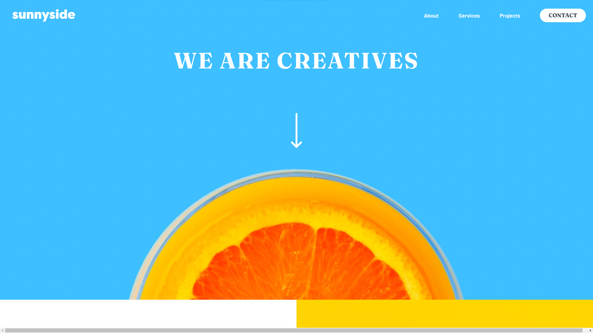

# Frontend Mentor - Sunnyside agency landing page solution

This is a solution to the [Sunnyside agency landing page challenge on Frontend Mentor](https://www.frontendmentor.io/challenges/sunnyside-agency-landing-page-7yVs3B6ef).

## The challenge

Users should be able to:

- View the optimal layout for the site depending on their device's screen size
- See hover states for all interactive elements on the page

### Screenshot

### Links

- Live Site URL: [Sunnyside](https://cruz-sunnyside.netlify.app/)

## My process

### Built with

- [React](https://reactjs.org/) - JS library
- [Vite](https://vitejs.dev/) - Buildtool
- [ReactIcons](https://react-icons.github.io/) - For Icons
- [Tailwindcss](https://tailwindcss.com/) - For Styles
- [Framer-motion](https://www.framer.com/motion/) - For Arrow animation

## Author

- Frontend Mentor - [@BlackBugger](https://www.frontendmentor.io/profile/BlackBugger)

